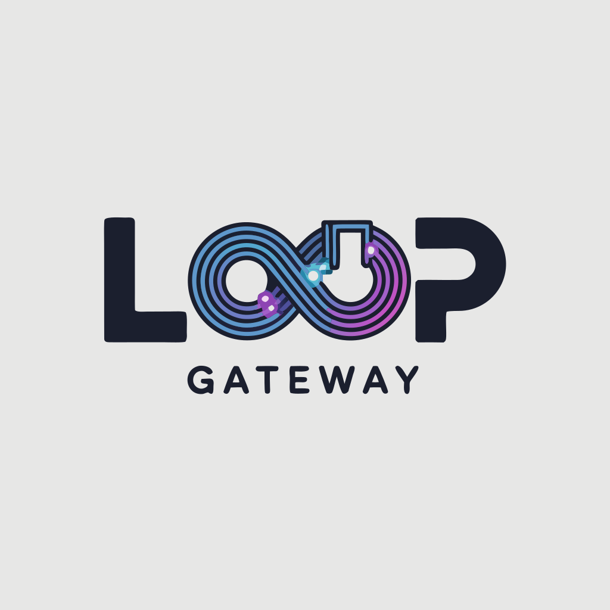

<p align="center">
  
</p>

<h1 align="center">Loop Gateway</h1>

<p align="center">An agentic AI loop gateway with multi-channel messaging support, container isolation, autonomous task execution, and a real-time web dashboard.</p>

Loop Gateway connects messaging platforms (Telegram, WhatsApp, Email) to Claude AI and runs agent interactions through a managed pipeline with conversation tracking, token usage analytics, and optional OS-level container isolation.

## Features

- **n8n / Make.com Integration** -- Ready-to-use n8n community nodes and Make.com blueprints. Drop "Loop Gateway" as a node into any workflow and connect AI agents to thousands of apps
- **Webhook Platform** -- Token-authenticated inbound/outbound webhooks for triggering agent runs and receiving events from any automation platform
- **Multi-Channel Messaging** -- Telegram, WhatsApp (via Baileys), and Email (IMAP/SMTP) adapters
- **Container Isolation** -- Run each agent call in an isolated Docker container (nanoclaw pattern: secrets via stdin, no network leaks)
- **Loop Mode** -- Autonomous task execution with prompt files (ralph-wiggum pattern: plan/build loops)
- **Agent Groups** -- Group agents with per-group system prompts, model selection, skills, budgets (daily/monthly token caps), and channel binding
- **Agent-to-Agent (A2A) Protocol** -- Multi-agent coordination with message bus, sub-agent spawning, predefined roles, task delegation, and broadcasting
- **Human-in-the-Loop (HITL)** -- Approval workflows with configurable risk levels per tool, auto-approve rules, timeouts, and real-time WebSocket notifications
- **Skills System** -- Dynamic, file-based tool extensions. Built-in tools are exported as skills; custom skills can be uploaded, toggled, and hot-reloaded
- **Built-in Agent Tools** -- Web browsing (Playwright), HTTP requests, script execution, and A2A tools (delegate, broadcast, query)
- **Scheduler** -- Cron-based job scheduling with iCal calendar integration and output routing to channels or webhooks
- **Usage Analytics** -- Per-call token tracking, cost estimation, daily/model breakdowns
- **Auth & Rate Limiting** -- Session-based login, admin setup flow, IP-based rate limiting
- **Real-time Dashboard** -- WebSocket-powered live activity feed, channel management, task monitoring
- **SQLite Persistence** -- All data (messages, runs, usage, sessions, approvals, schedules) in a single portable database

## Quick Start

### 1. Clone and configure

```bash
git clone <repo-url> loop-gateway
cd loop-gateway
cp .env.example .env
# Edit .env and set your ANTHROPIC_API_KEY
```

### 2. Run with Docker (recommended)

```bash
docker compose up -d
```

Open `http://localhost:3000` -- the first visit will prompt you to create an admin account.

### 3. Run locally (development)

```bash
npm install
npm run dev
```

## Common Commands

| Command | Description |
|---------|-------------|
| `docker compose up -d` | Start the gateway in background |
| `docker compose down` | Stop the gateway |
| `docker compose logs -f gateway` | View live logs |
| `docker compose up -d --build` | Rebuild and restart after code changes |
| `npm run dev` | Start in development mode with hot reload |
| `npm run build` | Compile TypeScript to `dist/` |
| `npm start` | Start the compiled production build |
| `npm run typecheck` | Run TypeScript type checking |
| `npm run lint` | Run ESLint |
| `npm run validate` | Run typecheck + lint + format check |
| `npm test` | Run tests |

## Architecture

```
┌──────────────────────────────────────────────────┐
│  Messaging Channels                              │
│  (Telegram, WhatsApp, Email)                     │
└──────────────┬───────────────────────────────────┘
               │
               ▼
┌──────────────────────────────────────────────────┐
│  Channel Manager                                 │
│  - Adapter lifecycle, message routing            │
│  - Whitelist filtering per channel               │
│  - Agent group binding                           │
└──────────────┬───────────────────────────────────┘
               │
               ▼
┌──────────────────────────────────────────────────┐
│  Agent Loop                                      │
│  - Direct mode: API call in-process              │
│  - Container mode: isolated Docker per call      │
│  - Token usage logging                           │
│  - HITL approval checks before tool execution    │
└──────────┬──────────────────┬────────────────────┘
           │                  │
           ▼                  ▼
┌────────────────────┐ ┌─────────────────────────┐
│  Tools & Skills    │ │  A2A Protocol           │
│  - web-browse      │ │  - Sub-agent spawning   │
│  - http-request    │ │  - Task delegation      │
│  - run-script      │ │  - Event broadcasting   │
│  - Custom skills   │ │  - Agent querying       │
└────────────────────┘ └─────────────────────────┘
               │
               ▼
┌──────────────────────────────────────────────────┐
│  SQLite Database                                 │
│  - Conversations, messages, agent runs           │
│  - API call log, usage analytics                 │
│  - Users, sessions, rate limits                  │
│  - Approvals, approval rules                     │
│  - Scheduled jobs, calendar events               │
│  - Agent groups, A2A messages                    │
└──────────────┬───────────────────────────────────┘
               │
               ▼
┌──────────────────────────────────────────────────┐
│  Scheduler                                       │
│  - Cron-based job execution                      │
│  - iCal calendar sync                            │
│  - Output routing (channels, webhooks)           │
└──────────────┬───────────────────────────────────┘
               │
               ▼
┌──────────────────────────────────────────────────┐
│  Web Dashboard (Express + WebSocket)             │
│  - Real-time event stream                        │
│  - Channel & agent group management              │
│  - Skills management                             │
│  - HITL approval queue                           │
│  - Scheduler & calendar management               │
│  - Usage analytics                               │
│  - Loop task management                          │
└──────────────────────────────────────────────────┘
```

## Container Isolation Mode

For high-security setups, each agent call can run in its own Docker container. The API key is passed via stdin (never on disk or in env vars), and containers run with memory/CPU limits.

### Enable container isolation

```bash
# 1. Build the agent runner image
docker build -t loop-gateway-agent:latest ./agent-runner

# 2. Set environment variable
echo "AGENT_CONTAINER_MODE=true" >> .env

# 3. Restart the gateway
docker compose up -d --build
```

### Configuration

| Variable | Default | Description |
|----------|---------|-------------|
| `AGENT_CONTAINER_MODE` | `false` | Enable container isolation |
| `MAX_CONCURRENT_CONTAINERS` | `3` | Max parallel agent containers |
| `CONTAINER_TIMEOUT_MS` | `600000` | Container timeout (10 min) |

## Agent Groups

Agent groups let you define separate agent configurations and bind them to channels. Each group can have its own system prompt, model, API key, skill set, and token budget.

### Via the API

```bash
# Create an agent group
curl -X POST http://localhost:3000/api/agent-groups \
  -H "Content-Type: application/json" \
  -H "Authorization: Bearer YOUR_TOKEN" \
  -d '{
    "name": "support-bot",
    "systemPrompt": "You are a customer support agent...",
    "model": "claude-sonnet-4-20250514",
    "budgetMaxTokensDay": 100000,
    "budgetMaxTokensMonth": 2000000
  }'

# Assign a channel to the group
curl -X POST http://localhost:3000/api/agent-groups/GROUP_ID/assign/CHANNEL_ID \
  -H "Authorization: Bearer YOUR_TOKEN"
```

## Human-in-the-Loop (HITL)

Tools can be configured with risk levels. High-risk tool calls pause and wait for human approval before executing. Approvals are delivered in real time via WebSocket and can be managed through the dashboard or API.

### Approval Rules

```bash
# Require approval for a specific tool
curl -X POST http://localhost:3000/api/approval-rules \
  -H "Content-Type: application/json" \
  -H "Authorization: Bearer YOUR_TOKEN" \
  -d '{
    "toolName": "run_script",
    "riskLevel": "high",
    "requireApproval": true,
    "timeoutSeconds": 300,
    "timeoutAction": "reject"
  }'
```

## Skills System

Skills extend the agent's tool set dynamically. Built-in tools (web-browse, http-request, run-script) are automatically exported as skills. Custom skills can be installed via the API and are hot-reloaded on file changes.

### Install a custom skill

```bash
curl -X POST http://localhost:3000/api/skills \
  -H "Content-Type: application/json" \
  -H "Authorization: Bearer YOUR_TOKEN" \
  -d '{
    "manifest": {
      "name": "my-tool",
      "description": "Does something useful",
      "version": "1.0.0",
      "inputSchema": { "type": "object", "properties": { "query": { "type": "string" } } }
    },
    "handler": "module.exports = async ({ query }) => ({ result: query.toUpperCase() });"
  }'
```

## Scheduler

Schedule recurring or one-off jobs with cron expressions. Jobs execute agent prompts and route the output to channels or webhooks. iCal calendar sources can be synced and used as context for scheduled agent runs.

### Create a scheduled job

```bash
curl -X POST http://localhost:3000/api/scheduler/jobs \
  -H "Content-Type: application/json" \
  -H "Authorization: Bearer YOUR_TOKEN" \
  -d '{
    "name": "daily-summary",
    "trigger": { "type": "cron", "cron": "0 9 * * *", "timezone": "Europe/Berlin" },
    "action": { "type": "agent", "prompt": "Summarize yesterday activity...", "maxIterations": 3 },
    "output": { "type": "channel", "channelId": "CHANNEL_ID" }
  }'
```

### Calendar integration

```bash
# Add an iCal calendar source
curl -X POST http://localhost:3000/api/scheduler/calendars \
  -H "Content-Type: application/json" \
  -H "Authorization: Bearer YOUR_TOKEN" \
  -d '{
    "name": "Team Calendar",
    "url": "https://calendar.example.com/team.ics",
    "pollIntervalMinutes": 15
  }'
```

## Loop Mode (Autonomous Tasks)

Create tasks that run in an autonomous loop. The agent reads a prompt, produces output, and repeats -- building on previous output each iteration -- until it signals completion or hits the iteration limit.

### Via the Web UI

1. Go to the **Loop Tasks** tab
2. Click **+ New Task**
3. Enter a name, prompt, and max iterations
4. The task starts automatically

### Via the API

```bash
# Create and start a loop task
curl -X POST http://localhost:3000/api/tasks \
  -H "Content-Type: application/json" \
  -H "Authorization: Bearer YOUR_TOKEN" \
  -d '{
    "name": "plan_feature",
    "prompt": "Create a detailed implementation plan for user authentication with OAuth2...",
    "maxIterations": 5
  }'

# Check task status
curl http://localhost:3000/api/tasks \
  -H "Authorization: Bearer YOUR_TOKEN"

# Stop a running task
curl -X POST http://localhost:3000/api/tasks/1/stop \
  -H "Authorization: Bearer YOUR_TOKEN"
```

## n8n Integration

Loop Gateway ships with a ready-to-use **n8n community node package** (`n8n-nodes-loop-gateway`) that lets you drop AI agents directly into your n8n workflows.

### Install the n8n Node

```bash
# In your n8n instance
cd ~/.n8n
npm install /path/to/loop-gateway/integrations/n8n
# Or publish to npm and install: npm install n8n-nodes-loop-gateway
```

### Available Nodes

| Node | Type | Description |
|------|------|-------------|
| **Loop Gateway** | Action | Run agents, create tasks, list groups, get usage stats |
| **Loop Gateway Trigger** | Trigger | Start workflows when Loop Gateway events fire (agent runs, task completions, approvals) |

### Quick Start: n8n + Loop Gateway

1. **Create a webhook** in Loop Gateway:
   ```bash
   curl -X POST http://localhost:3000/api/webhooks \
     -H "Content-Type: application/json" \
     -H "Authorization: Bearer YOUR_TOKEN" \
     -d '{"name": "n8n-workflow", "platform": "n8n", "events": ["*"]}'
   ```
2. **Add credentials** in n8n: Settings > Credentials > Loop Gateway API
3. **Use the Loop Gateway node** in your workflow to send prompts and get AI responses
4. **Use the Loop Gateway Trigger** to react to events (e.g. notify Slack when an agent finishes)

### Example Workflows

**AI Content Pipeline:**
Schedule Trigger > Loop Gateway (Run Agent) > Google Sheets (Append Row)

**Approval Notification:**
Loop Gateway Trigger (approval:required) > Slack (Send Message) > Wait > Loop Gateway (Approve/Reject)

**Multi-Agent Research:**
Webhook Trigger > Loop Gateway (Create Task) > Wait > Loop Gateway (Get Task Status) > Email (Send)

## Make.com Integration

Ready-to-import Make.com scenario blueprints are included in `integrations/make/`.

### Available Blueprints

| Blueprint | Description |
|-----------|-------------|
| `run-agent.json` | Send a prompt to Loop Gateway and get an AI response |
| `agent-to-google-sheets.json` | AI agent + Google Sheets pipeline |
| `webhook-trigger.json` | Receive Loop Gateway events and route to Slack |

### Setup

1. Create a webhook in Loop Gateway (see above)
2. In Make.com: Scenarios > Create > Import Blueprint
3. Paste the JSON from `integrations/make/` and update the URL + token

### Custom HTTP Module

For custom scenarios, use the Make.com HTTP module:

```
POST https://your-gateway.com/webhook/invoke/YOUR_TOKEN
Content-Type: application/json

{"message": "Your prompt here", "sync": true}
```

## Webhooks

Loop Gateway includes a full webhook platform for integrating with any external system. Webhooks support both inbound (trigger agent runs) and outbound (receive events) patterns.

### Create a Webhook

```bash
curl -X POST http://localhost:3000/api/webhooks \
  -H "Content-Type: application/json" \
  -H "Authorization: Bearer YOUR_TOKEN" \
  -d '{
    "name": "my-integration",
    "platform": "generic",
    "events": ["agent:run:complete", "task:complete"],
    "targetUrl": "https://example.com/my-webhook-receiver"
  }'
```

The response includes a `token` used for inbound triggers and a `targetUrl` for outbound events.

### Inbound: Trigger an Agent Run

```bash
# Send a message to an AI agent (synchronous -- waits for response)
curl -X POST http://localhost:3000/webhook/invoke/YOUR_WEBHOOK_TOKEN \
  -H "Content-Type: application/json" \
  -d '{"message": "Summarize this article...", "sync": true}'

# Create a loop task
curl -X POST http://localhost:3000/webhook/task/YOUR_WEBHOOK_TOKEN \
  -H "Content-Type: application/json" \
  -d '{"name": "research", "prompt": "Research AI trends...", "maxIterations": 5}'
```

### Outbound: Receive Events

When events occur, Loop Gateway POSTs to your `targetUrl`:

```json
{
  "event": "agent:run:complete",
  "payload": {
    "runId": 42,
    "conversationId": "...",
    "inputTokens": 1500,
    "outputTokens": 800,
    "durationMs": 3200
  },
  "timestamp": "2025-01-15T10:30:00.000Z",
  "source": "loop-gateway"
}
```

### Supported Events

| Event | Description |
|-------|-------------|
| `agent:run:start` | Agent run started |
| `agent:run:complete` | Agent run finished successfully |
| `agent:run:error` | Agent run failed |
| `task:start` | Loop task started |
| `task:complete` | Loop task finished |
| `task:error` | Loop task failed |
| `task:iteration` | Loop task completed an iteration |
| `approval:required` | HITL approval requested |
| `approval:resolved` | HITL approval approved/rejected |
| `scheduler:job:complete` | Scheduled job finished |
| `message:incoming` | New message received on a channel |
| `message:reply` | Agent reply sent to a channel |
| `*` | Subscribe to all events |

## API Reference

All endpoints require authentication (session token) unless the system is in setup mode.

### Auth

| Method | Endpoint | Description |
|--------|----------|-------------|
| GET | `/api/auth/status` | Check if setup is required |
| POST | `/api/auth/setup` | Create initial admin account |
| POST | `/api/auth/login` | Login, returns session token |
| POST | `/api/auth/logout` | Invalidate current session |

### Channels

| Method | Endpoint | Description |
|--------|----------|-------------|
| GET | `/api/channels` | List all channels with status |
| POST | `/api/channels` | Create a new channel |
| PUT | `/api/channels/:id` | Update channel config |
| DELETE | `/api/channels/:id` | Delete a channel |

### Agent Groups

| Method | Endpoint | Description |
|--------|----------|-------------|
| GET | `/api/agent-groups` | List all agent groups |
| POST | `/api/agent-groups` | Create an agent group |
| GET | `/api/agent-groups/:id` | Get agent group details |
| PUT | `/api/agent-groups/:id` | Update an agent group |
| DELETE | `/api/agent-groups/:id` | Delete an agent group |
| POST | `/api/agent-groups/:id/assign/:channelId` | Bind a channel to a group |
| POST | `/api/agent-groups/:id/unassign/:channelId` | Unbind a channel from a group |
| GET | `/api/agent-groups/:id/stats` | Get group usage stats |

### A2A (Agent-to-Agent)

| Method | Endpoint | Description |
|--------|----------|-------------|
| GET | `/api/agents` | List active agents, stats, and predefined roles |
| GET | `/api/a2a/messages` | Recent A2A messages |
| GET | `/api/a2a/conversations/:id` | Messages for a specific A2A conversation |

### Skills

| Method | Endpoint | Description |
|--------|----------|-------------|
| GET | `/api/skills` | List all skills (built-in + custom) |
| POST | `/api/skills` | Install a custom skill |
| PUT | `/api/skills/:name` | Update a skill |
| DELETE | `/api/skills/:name` | Delete a custom skill |
| POST | `/api/skills/:name/toggle` | Enable or disable a skill |

### Tools

| Method | Endpoint | Description |
|--------|----------|-------------|
| GET | `/api/tools` | List all registered tools |

### HITL Approvals

| Method | Endpoint | Description |
|--------|----------|-------------|
| GET | `/api/approvals` | List approvals (filter by `?status=pending`) |
| GET | `/api/approvals/stats` | Approval statistics |
| GET | `/api/approvals/:id` | Get a specific approval request |
| GET | `/api/approvals/run/:runId` | Get approvals for an agent run |
| POST | `/api/approvals/:id/approve` | Approve a pending request |
| POST | `/api/approvals/:id/reject` | Reject a pending request |
| GET | `/api/approval-rules` | List approval rules + defaults |
| POST | `/api/approval-rules` | Create or update an approval rule |
| DELETE | `/api/approval-rules/:toolName` | Delete an approval rule |

### Scheduler

| Method | Endpoint | Description |
|--------|----------|-------------|
| GET | `/api/scheduler/jobs` | List all scheduled jobs |
| POST | `/api/scheduler/jobs` | Create a scheduled job |
| PUT | `/api/scheduler/jobs/:id` | Update a job |
| DELETE | `/api/scheduler/jobs/:id` | Delete a job |
| POST | `/api/scheduler/jobs/:id/toggle` | Enable or disable a job |
| POST | `/api/scheduler/jobs/:id/run` | Trigger a job manually |
| GET | `/api/scheduler/jobs/:id/runs` | Job execution history |
| GET | `/api/scheduler/stats` | Scheduler statistics |
| GET | `/api/scheduler/calendars` | List calendar sources |
| POST | `/api/scheduler/calendars` | Add a calendar source |
| POST | `/api/scheduler/calendars/:id/sync` | Sync a calendar now |
| GET | `/api/scheduler/calendars/:id/events` | Get calendar events |
| DELETE | `/api/scheduler/calendars/:id` | Delete a calendar source |

### Usage Analytics

| Method | Endpoint | Description |
|--------|----------|-------------|
| GET | `/api/usage` | Overall usage summary + cost |
| GET | `/api/usage/daily` | Daily token breakdown |
| GET | `/api/usage/models` | Usage grouped by model |
| GET | `/api/usage/calls` | Recent individual API calls |

### Loop Tasks

| Method | Endpoint | Description |
|--------|----------|-------------|
| GET | `/api/tasks` | List all loop tasks |
| POST | `/api/tasks` | Create and start a task |
| POST | `/api/tasks/:id/start` | Restart a stopped task |
| POST | `/api/tasks/:id/stop` | Stop a running task |
| GET | `/api/tasks/:id/prompt` | Get task prompt |
| GET | `/api/tasks/:id/output` | Get task output |
| DELETE | `/api/tasks/:id` | Delete a task |

### Webhooks

| Method | Endpoint | Description |
|--------|----------|-------------|
| GET | `/api/webhooks` | List all registered webhooks |
| POST | `/api/webhooks` | Create a new webhook (returns token) |
| GET | `/api/webhooks/events` | List supported webhook events |
| GET | `/api/webhooks/:id` | Get webhook details |
| PUT | `/api/webhooks/:id` | Update a webhook |
| DELETE | `/api/webhooks/:id` | Delete a webhook |
| GET | `/api/webhooks/:id/logs` | Webhook delivery logs |

### Webhook Inbound Endpoints (Token Auth)

| Method | Endpoint | Description |
|--------|----------|-------------|
| POST | `/webhook/invoke/:token` | Trigger an agent run via webhook |
| POST | `/webhook/task/:token` | Create a loop task via webhook |
| GET | `/webhook/health/:token` | Validate webhook token |

### Other

| Method | Endpoint | Description |
|--------|----------|-------------|
| GET | `/api/runs` | Recent agent runs |
| GET | `/api/health` | Health check + uptime |

## Adding Channels

### Telegram

1. Create a bot with [@BotFather](https://t.me/BotFather) on Telegram
2. In the Web UI, click **+ Add Channel** > Telegram
3. Paste the bot token
4. Optionally add allowed user IDs for access control

### WhatsApp

1. In the Web UI, click **+ Add Channel** > WhatsApp
2. A QR code will appear -- scan it with WhatsApp on your phone
3. Messages to the connected WhatsApp number will be processed by the agent

### Email

1. In the Web UI, click **+ Add Channel** > Email
2. Enter IMAP and SMTP credentials
3. The gateway polls for new emails and replies via SMTP

## Project Structure

```
├── src/
│   ├── index.ts                    # Entry point
│   ├── config.ts                   # Environment configuration
│   ├── agent/
│   │   ├── loop.ts                 # Agent loop (direct + container modes)
│   │   ├── container-runner.ts     # Docker container spawning
│   │   ├── loop-mode.ts            # Autonomous task loop
│   │   ├── a2a/                    # Agent-to-Agent protocol
│   │   │   ├── bus.ts              # Message bus (send, receive, events)
│   │   │   ├── protocol.ts         # A2A message types and roles
│   │   │   ├── spawner.ts          # Sub-agent lifecycle management
│   │   │   └── tools.ts            # A2A tools (delegate, broadcast, query)
│   │   ├── groups/                 # Agent group management
│   │   │   ├── manager.ts          # CRUD, channel binding, budgets
│   │   │   ├── encryption.ts       # API key encryption
│   │   │   ├── resolver.ts         # Group resolution for channels
│   │   │   └── types.ts            # Group type definitions
│   │   ├── hitl/                   # Human-in-the-Loop approvals
│   │   │   ├── db.ts               # Approval persistence + rules
│   │   │   ├── manager.ts          # Approval workflow engine
│   │   │   ├── notify.ts           # WebSocket notifications
│   │   │   └── types.ts            # Risk levels, approval types
│   │   ├── skills/                 # Skill extension system
│   │   │   ├── loader.ts           # Scan, load, install, toggle skills
│   │   │   ├── schema.ts           # Skill manifest schema
│   │   │   ├── watcher.ts          # File-system hot reload
│   │   │   └── builtin-exporter.ts # Export built-in tools as skills
│   │   └── tools/                  # Built-in agent tools
│   │       ├── registry.ts         # Tool registry
│   │       ├── web-browse.ts       # Playwright web browsing
│   │       ├── http-request.ts     # HTTP request tool
│   │       ├── run-script.ts       # Script execution tool
│   │       └── types.ts            # Tool type definitions
│   ├── auth/
│   │   └── middleware.ts            # Session auth, rate limiting
│   ├── channels/
│   │   ├── base.ts                 # Abstract channel adapter
│   │   ├── manager.ts              # Channel lifecycle + routing
│   │   ├── telegram.ts             # Telegram adapter
│   │   ├── whatsapp.ts             # WhatsApp adapter (Baileys)
│   │   └── email.ts                # Email adapter (IMAP/SMTP)
│   ├── db/
│   │   └── sqlite.ts               # Database schema + queries
│   ├── gateway/
│   │   ├── server.ts               # Express + WebSocket server
│   │   └── api.ts                  # REST API routes
│   ├── webhooks/                   # Webhook integration platform
│   │   ├── types.ts                # Webhook type definitions
│   │   ├── db.ts                   # Webhook persistence + logs
│   │   ├── dispatcher.ts           # Outbound event dispatching
│   │   ├── inbound.ts              # Inbound webhook handlers
│   │   └── index.ts                # Public API
│   └── scheduler/                  # Job scheduling system
│       ├── engine.ts               # Cron scheduling engine
│       ├── cron-builder.ts         # Trigger-to-cron conversion
│       ├── calendar-sync.ts        # iCal calendar polling + sync
│       ├── output-router.ts        # Route job output to channels/webhooks
│       ├── db.ts                   # Job and calendar persistence
│       └── types.ts                # Scheduler type definitions
├── integrations/                   # External platform integrations
│   ├── n8n/                        # n8n community node package
│   │   ├── nodes/LoopGateway/      # Loop Gateway + Trigger nodes
│   │   ├── credentials/            # n8n credential definitions
│   │   ├── package.json
│   │   └── tsconfig.json
│   └── make/                       # Make.com scenario blueprints
│       ├── run-agent.json          # Basic agent run blueprint
│       ├── agent-to-google-sheets.json  # Agent + Sheets pipeline
│       └── webhook-trigger.json    # Event-driven blueprint
├── agent-runner/                   # Isolated agent Docker image
│   ├── Dockerfile
│   ├── package.json
│   └── runner.js                   # Stdin/stdout agent runner
├── tests/
│   └── hitl.test.ts                # HITL approval tests
├── ui/
│   └── index.html                  # Single-page web dashboard
├── docker-compose.yml
├── Dockerfile
├── system-prompt.md                # Default agent system prompt
├── tsconfig.json
├── eslint.config.mjs
├── .prettierrc
└── .env.example                    # Configuration template
```

## Security Notes

- **Auth**: The first visitor creates the admin account. All subsequent API requests require a session token.
- **Rate Limiting**: 120 requests per minute per IP on API endpoints.
- **Container Isolation**: When enabled, the API key never touches disk -- it's passed via stdin. Containers run with `--read-only`, memory limits, and CPU caps.
- **HITL Approvals**: High-risk tools can be gated behind human approval, preventing unreviewed execution of dangerous operations.
- **Agent Group API Keys**: Per-group API keys are stored with AES-256 encryption, never returned in API responses.
- **Skills Sandboxing**: Custom skills are always sandboxed.
- **Channel Whitelists**: Telegram and Email adapters support sender whitelists for access control.
- **Credentials**: All secrets stay in `.env` (never committed). The `.gitignore` excludes `.env` and `/data/`.

## License

MIT
