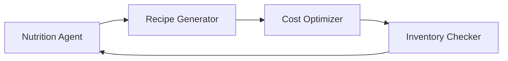
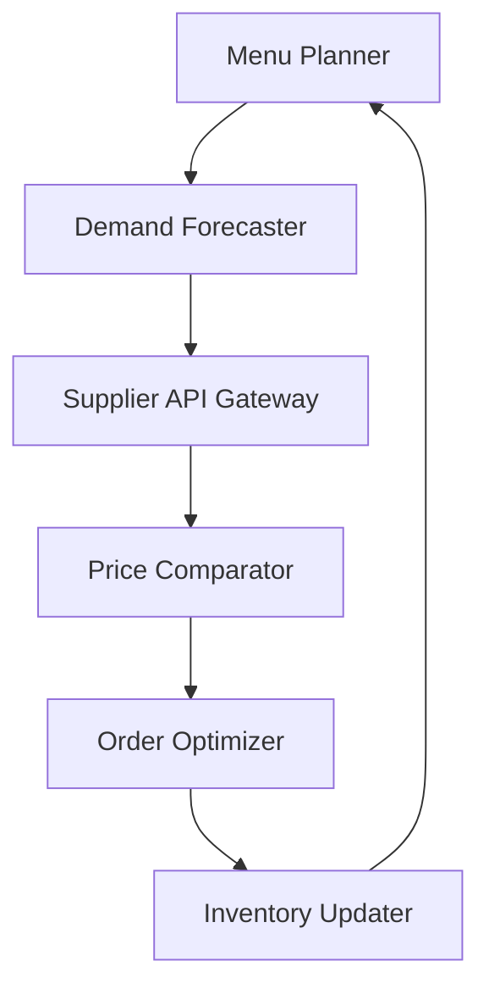

# Von der Steinzeit ins KI-Zeitalter: Wie Loop-Gateway die B2B Lebensmittelbranche revolutioniert

Die B2B Lebensmittelbranche ist ein Dinosaurier. Während Netflix uns Serien empfiehlt und Tesla autonom fährt, bestellen Großküchen noch immer per Fax und planen Menüs mit Excel-Tabellen aus den 90ern. Aber was wäre, wenn wir **Agentic Loops** einsetzen könnten, um diese Industrie endlich ins KI-Zeitalter zu befördern?

## Das Problem: Stuck in den 50ern

Stell dir vor: Du leitest die Einkaufsabteilung einer Krankenhauskette mit 50 Standorten. Jeden Montag das gleiche Ritual:

- 📋 Menüpläne manuell durchgehen
- 🧮 Nährwerte mit dem Taschenrechner addieren
- 📞 Bei 15 verschiedenen Lieferanten anrufen
- 📧 Bestellungen per E-Mail versenden
- 😤 Hoffen, dass nichts schiefgeht

**Das Resultat?** Verschwendete Zeit, suboptimale Nährwerte, überteuerte Einkäufe und gestresste Mitarbeiter.

## Die Lösung: Agentic Loops mit Loop-Gateway

Was wäre, wenn ein intelligentes System aus vernetzten AI-Agenten diese gesamte Prozesskette automatisieren könnte? Willkommen in der Welt der **Agentic Food Loops**.

### Der Rezept-Optimierungsloop



**Der Loop in Aktion:**

1. **Nutrition Agent**: "Wir brauchen 2000 kcal pro Portion, max. 5g Salz, mindestens 30g Protein"
2. **Recipe Generator**: "Hier sind 5 Rezeptvarianten, die diese Kriterien erfüllen"
3. **Cost Optimizer**: "Variante 3 ist 23% günstiger bei gleichwertigen Nährstoffen"
4. **Inventory Checker**: "Aber wir haben zu wenig Hähnchenbrust auf Lager. Alternative: Linsen-Quinoa-Bowl"

Das System optimiert sich **kontinuierlich selbst** - jeden Tag werden die Rezepte basierend auf Kosten, Verfügbarkeit und Nährwerten angepasst.

### Der Einkaufs-Orchestrierungsloop



**Beispiel-Szenario:** Eine Schulkantine plant Essen für 1200 Schüler.

1. **Menu Planner**: Generiert Wochenmenü basierend auf Saison, Budget und Nährwertzielen
2. **Demand Forecaster**: "Historisch essen 15% weniger am Freitag, also 180 Portionen weniger"
3. **Supplier API Gateway**: Fragt gleichzeitig bei Metro, Selgros und regionalen Anbietern Preise ab
4. **Price Comparator**: "Tomaten sind bei Anbieter A 12% günstiger, aber Lieferzeit 3 Tage länger"
5. **Order Optimizer**: Balanciert Kosten, Lieferzeit und Qualität
6. **Inventory Updater**: Aktualisiert Lagerbestände in Echtzeit

## Case Study: Seniorenheime Gruppe "Goldener Lebensabend"

### Die Ausgangslage
- 25 Standorte in Deutschland
- 3500 Bewohner mit individuellen Diätanforderungen
- Bisheriger Prozess: 40h/Woche nur für Menüplanung und Einkauf
- Lebensmittelverschwendung: 18% (Industriestandard: 15%)

### Das Agentic Loop Setup

**Channel 1: Nutrition & Compliance**
- `nutrition-specialist`: Überwacht Kalorien, Vitamine, Allergene
- `compliance-guardian`: Prüft Hygienevorschriften und Zertifizierungen
- `dietary-advisor`: Berücksichtigt individuelle Diäten (Diabetes, Schluckbeschwerden)

**Channel 2: Supply Chain Optimization**
- `inventory-prophet`: Prognostiziert Verbrauch pro Standort
- `supplier-negotiator`: Verhandelt Preise und Konditionen
- `logistics-coordinator`: Optimiert Lieferrouten und -zeiten

**Channel 3: Menu Intelligence**
- `menu-architect`: Erstellt abwechslungsreiche, saisonale Pläne
- `cost-accountant`: Hält Budgetvorgaben ein
- `taste-optimizer`: Lernt aus Bewohnerfeedback

### Die Ergebnisse nach 6 Monaten

| Metrik | Vorher | Nachher | Verbesserung |
|--------|---------|----------|--------------|
| Planungszeit | 40h/Woche | 4h/Woche | **-90%** |
| Einkaufskosten | €2.8M/Jahr | €2.2M/Jahr | **-21%** |
| Lebensmittelverschwendung | 18% | 8% | **-56%** |
| Bewohnerzufriedenheit | 6.2/10 | 8.4/10 | **+35%** |
| Nährwert-Compliance | 73% | 97% | **+33%** |

## Technische Integration: Von der API zur Realität

### Schritt 1: Einkaufsgruppen-API Anbindung

```javascript
// Beispiel: Metro API Integration
const metroAgent = {
  name: 'metro-connector',
  role: 'supplier-interface',
  capabilities: [
    'product-catalog-sync',
    'real-time-pricing',
    'inventory-availability',
    'automated-ordering'
  ]
}
```

**Was passiert hinter den Kulissen:**
- Tägliche Synchronisation des Produktkatalogs
- Echtzeit-Preisabfragen
- Automatische Verfügbarkeitsprüfung
- Direkte Bestellübermittlung per API

### Schritt 2: Inventar-Management

```javascript
// Beispiel: Warehouse Management Integration
const inventoryLoop = [
  {
    agent: 'stock-tracker',
    task: 'Monitor current inventory levels',
    triggers: ['new-delivery', 'consumption-update']
  },
  {
    agent: 'reorder-calculator', 
    task: 'Calculate optimal reorder points',
    considers: ['consumption-patterns', 'lead-times', 'shelf-life']
  },
  {
    agent: 'waste-minimizer',
    task: 'Suggest usage for items near expiry',
    actions: ['recipe-modification', 'portion-adjustment', 'donation-alert']
  }
]
```

### Schritt 3: Nährwert-Compliance Loop

```javascript
const nutritionLoop = {
  channels: ['nutrition-analysis', 'compliance-check', 'optimization'],
  agents: {
    'macro-calculator': 'Tracks proteins, carbs, fats per meal',
    'micro-monitor': 'Ensures vitamin/mineral requirements',
    'allergen-guardian': 'Flags potential allergen issues',
    'portion-optimizer': 'Adjusts serving sizes for demographics'
  }
}
```

## Weitere Anwendungsfälle: Das Potenzial ist grenzenlos

### Industriekantinen
**Herausforderung:** 10.000 Mitarbeiter, 3 Schichten, verschiedene Kulturen
**Loop-Lösung:** Dynamische Menüs basierend auf Schichtplänen und kulturellen Präferenzen

### Krankenhäuser
**Herausforderung:** Spezialdiäten, Hygieneanforderungen, 24/7 Betrieb
**Loop-Lösung:** Medizinische KI integriert Diätpläne mit Behandlungsplänen

### Schulen & Universitäten
**Herausforderung:** Budget-Constraints, Geschmackspräferenzen, Bildungsauftrag
**Loop-Lösung:** Lern-KI analysiert Essverhalten und optimiert für Akzeptanz

### Catering & Events
**Herausforderung:** Variable Größen, kurzfristige Änderungen, Perfektion erwartet
**Loop-Lösung:** Predictive Analytics für Portionsgrößen und Szenario-Planung

## Die Revolution hat bereits begonnen

Während traditionelle Software statisch ist, sind **Agentic Loops** dynamisch, lernend und sich selbst optimierend. Sie:

- 🔄 **Passen sich kontinuierlich an** neue Gegebenheiten an
- 🤝 **Kollaborieren intelligent** zwischen verschiedenen Fachbereichen
- 📊 **Lernen aus Daten** und werden jeden Tag besser
- ⚡ **Reagieren in Echtzeit** auf Änderungen und Störungen

Die B2B Lebensmittelbranche steht vor einem Wendepunkt. Die Frage ist nicht mehr **ob**, sondern **wann** und **wie schnell** die Transformation stattfinden wird.

**Unternehmen, die jetzt auf Agentic Loops setzen, werden die Marktführer von morgen sein. Der Rest wird Geschichte.**

---

*Bereit für den Sprung ins KI-Zeitalter? Loop-Gateway macht's möglich. Von der ersten Idee bis zur vollautomatisierten Supply Chain - in Agentic Loops, die niemals schlafen.*